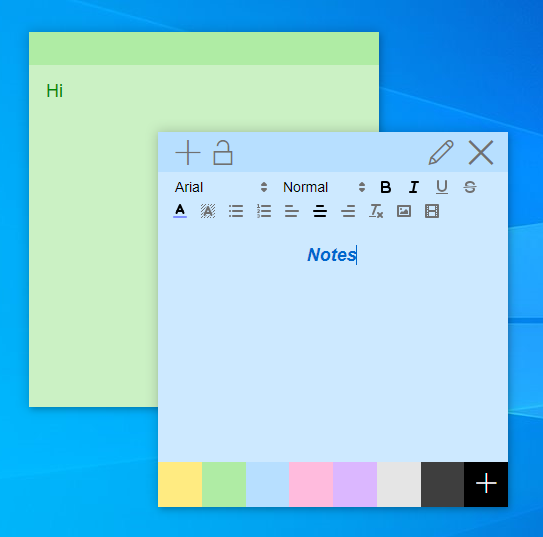

## Description




### A Open Source Sticky Note Application.
### Emoji Selecter
### Automatically Save Notes
### Choose Background And Title Bar Color You Like
### Editing Options Like Font,Bold,Size,.etc
### Add Images To Note From Local Drive
### Lock The Note
### Electron Based
### Using Quill Editing Capability
### Uses Some jQuery
### Electron-Context-Menu for Context Menu
### Using Store For Saving Notes
### Using Vue As Front End Framework

### If you like my App please consider buying me a coffee at [HERE!](http://buymeacoff.ee/playork)
### Fell Free To Fork Or Clone
## Install

### For Development Version Follow the instuctions below

if you want to try it install [nodejs](https://nodejs.org), [git](https://git-scm.com/), [Vue CLI](https://cli.vuejs.org/) and clone this repository

```bash
git clone https://github.com/Playork/StickyNotes
```

point to source directory

```bash
cd /path/to/source/of/Sticky-Note
```

and install depencise by

```bash
npm install
```

after this start this application by this command

```bash
npm start
```

build for production by this command

```bash
npm run build
```

## Licence

MIT License (MIT)

Copyright (c) 2019 Playork

Permission is hereby granted, free of charge, to any person obtaining a copy of this software and associated documentation files (the "Software"), to deal in the Software without restriction, including without limitation the rights to use, copy, modify, merge, publish, distribute, sublicense, and/or sell copies of the Software, and to permit persons to whom the Software is furnished to do so, subject to the following conditions:

The above copyright notice and this permission notice shall be included in all copies or substantial portions of the Software.

THE SOFTWARE IS PROVIDED "AS IS", WITHOUT WARRANTY OF ANY KIND, EXPRESS OR IMPLIED, INCLUDING BUT NOT LIMITED TO THE WARRANTIES OF MERCHANTABILITY, FITNESS FOR A PARTICULAR PURPOSE AND NONINFRINGEMENT. IN NO EVENT SHALL THE AUTHORS OR COPYRIGHT HOLDERS BE LIABLE FOR ANY CLAIM, DAMAGES OR OTHER LIABILITY, WHETHER IN AN ACTION OF CONTRACT, TORT OR OTHERWISE, ARISING FROM, OUT OF OR IN CONNECTION WITH THE SOFTWARE OR THE USE OR OTHER DEALINGS IN THE SOFTWARE.
